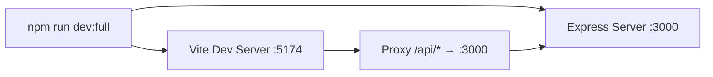
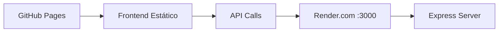

# Configuración del Servidor Multijugador para Producción

## 🎯 Objetivo Completado

Se ha configurado el proyecto para que el modo multijugador funcione tanto en desarrollo local como en producción (GitHub Pages + servidor desplegado).

## 📝 Cambios Realizados

### 1. Configuración de Variables de Entorno

Se crearon archivos de configuración para diferentes entornos:

#### Archivos Creados
- **`.env`** - Configuración local (no se sube a Git)
  ```env
  VITE_API_URL=http://localhost:3000
  ```

- **`.env.example`** - Plantilla de ejemplo
- **`.env.production`** - Configuración para GitHub Pages
  ```env
  VITE_API_URL=https://shogi-server.onrender.com
  ```

### 2. Actualización del Módulo API

**Archivo:** `src/services/api.ts`

Se modificó para usar variables de entorno en lugar de rutas hardcodeadas:

```typescript
const API_URL = import.meta.env.VITE_API_URL || '';

export const api = {
    createGame: async (): Promise<{ token: string }> => {
        const response = await fetch(`${API_URL}/api/create`, {
            method: 'POST',
        });
        // ...
    },
    // ... otros métodos
};
```

**Beneficio:** El frontend ahora puede conectarse a diferentes servidores según el entorno (local vs producción).

### 3. Configuración de CORS en el Servidor

**Archivo:** `server/index.js`

Se actualizó la configuración de CORS para permitir requests desde:
- Desarrollo local: `http://localhost:5174`
- Producción: `https://raccoonlx.github.io`

```javascript
app.use(cors({
  origin: [
    'http://localhost:5174',
    'https://raccoonlx.github.io'
  ],
  credentials: true
}));
```

### 4. Script de Desarrollo Mejorado

**Archivo:** `package.json`

Se agregó el script `dev:full` usando `concurrently`:

```json
{
  "scripts": {
    "dev:full": "concurrently \"npm run server\" \"npm run dev\""
  }
}
```

**Uso:**
```bash
npm run dev:full  # Inicia ambos servidores simultáneamente
```

### 5. Archivos de Despliegue para Render.com

#### `render.yaml`
Configuración para despliegue automático en Render:

```yaml
services:
  - type: web
    name: shogi-server
    runtime: node
    buildCommand: npm install
    startCommand: node server/index.js
```

#### `server/package.json`
Package.json específico para el servidor con configuración mínima.

### 6. Actualización de `.gitignore`

Se configuró para:
- ✅ Ignorar `.env` (credenciales locales)
- ✅ Permitir `.env.example` y `.env.production` (configuración compartida)

## 📚 Documentación Creada

### Guías para el Usuario

1. **`COMO_EJECUTAR_SERVIDOR.md`**
   - Cómo ejecutar el servidor localmente
   - Explicación de los comandos disponibles
   - Solución de problemas comunes

2. **`GUIA_DESPLIEGUE.md`**
   - Paso a paso para desplegar en Render.com
   - Configuración de GitHub Pages
   - Verificación y troubleshooting

3. **`DEPLOYMENT_PLAN.md`**
   - Plan técnico de despliegue
   - Comparación de opciones de hosting
   - Arquitectura de la solución

## 🔄 Flujo de Trabajo

### Desarrollo Local



1. `npm run dev:full` inicia ambos servidores
2. Vite sirve el frontend en puerto 5174
3. Express maneja el API en puerto 3000
4. Vite proxy redirige `/api/*` al servidor Express

### Producción



1. GitHub Pages sirve el frontend estático
2. El frontend hace llamadas a `https://shogi-server.onrender.com/api/*`
3. Render.com ejecuta el servidor Express
4. CORS permite requests desde `raccoonlx.github.io`

## ✅ Estado Actual

### Completado
- [x] Configuración de variables de entorno
- [x] Actualización del módulo API
- [x] Configuración de CORS
- [x] Script de desarrollo concurrente
- [x] Archivos de configuración para Render
- [x] Documentación completa
- [x] Actualización de `.gitignore`

### Pendiente (Requiere Acción del Usuario)
- [ ] Crear cuenta en Render.com
- [ ] Desplegar el servidor en Render
- [ ] Actualizar `.env.production` con la URL real del servidor
- [ ] Hacer build y desplegar a GitHub Pages
- [ ] Probar la funcionalidad en producción

## 🧪 Cómo Probar

### Local

```bash
# 1. Iniciar ambos servidores
npm run dev:full

# 2. En otra terminal, probar el API
curl -X POST http://localhost:3000/api/create

# 3. Abrir en el navegador
# http://localhost:5174/Shogi/

# 4. Hacer clic en "Desafiar a un Amigo"
# Deberías ver un token de 6 caracteres
```

### Producción (Después del Despliegue)

```bash
# 1. Probar el servidor desplegado
curl -X POST https://tu-servidor.onrender.com/api/create

# 2. Abrir la app en GitHub Pages
# https://raccoonlx.github.io/Shogi/

# 3. Probar crear un token
```

## 📊 Archivos Modificados

| Archivo | Tipo | Descripción |
|---------|------|-------------|
| `src/services/api.ts` | Modificado | Usa variables de entorno |
| `server/index.js` | Modificado | CORS configurado |
| `package.json` | Modificado | Agregado `dev:full` script |
| `.gitignore` | Modificado | Protege `.env` local |
| `.env` | Nuevo | Config local |
| `.env.example` | Nuevo | Plantilla |
| `.env.production` | Nuevo | Config producción |
| `render.yaml` | Nuevo | Config Render |
| `server/package.json` | Nuevo | Package del servidor |
| `GUIA_DESPLIEGUE.md` | Nuevo | Guía de despliegue |
| `COMO_EJECUTAR_SERVIDOR.md` | Nuevo | Guía de uso local |

## 🚀 Próximos Pasos

Sigue la guía en `GUIA_DESPLIEGUE.md` para:

1. Desplegar el servidor en Render.com (5-10 minutos)
2. Actualizar la configuración de producción
3. Desplegar a GitHub Pages
4. ¡Jugar Shogi en modo multijugador desde cualquier lugar!

---

**Nota:** El código está listo para funcionar tanto en local como en producción. Solo falta completar el despliegue del servidor siguiendo la guía.
